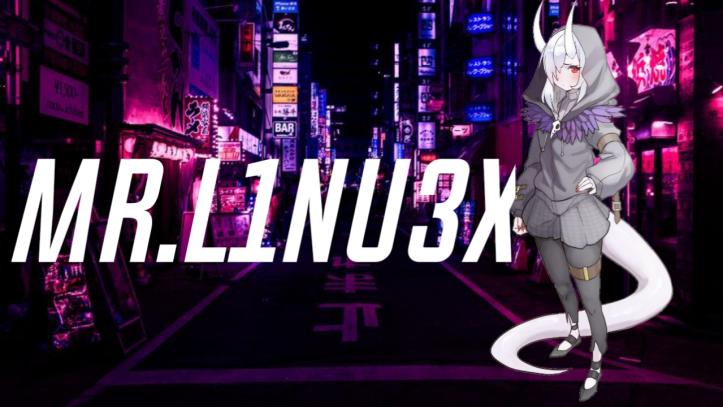

  

<h1 align="center">Hi, I'm MR.L1NU3X</a>!</h1>
<h1 align="center">Welcome to my GitHub profile~ OwO</h1>

  

  <strong><a href="https://www.youtube.com/c/3XPLOITIDOFFICIAL">Official Youtube</a></strong> |
  <strong><a href="https://twitter.com/MR_L1NU3X">Twitter</a></strong> |
  <strong><a href="https://www.instagram.com/3xploit.id/?hl=en">Instagram</a></strong> |
  <strong><a href="https://web.facebook.com/linux.gans/">Facebook</a></strong>

❤ I'm currently working on some scripts, and Content Creation on youtube.

<!--
**edisonlee55/edisonlee55** is a ✨ _special_ ✨ repository because its `README.md` (this file) appears on your GitHub profile.

Here are some ideas to get you started:

- 🔭 I’m currently working on ...
- 🌱 I’m currently learning ...
- 👯 I’m looking to collaborate on ...
- 🤔 I’m looking for help with ...
- 💬 Ask me about ...
- 📫 How to reach me: ...
- 😄 Pronouns: ...
- ⚡ Fun fact: ...
-->
